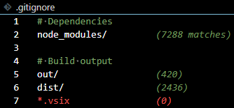

# IgnoreLens

A VS Code extension that shows how many files each ignore pattern matches and highlights redundant patterns.



## Features

### Match Counts

Each pattern displays a count showing its effect on the ignore set:

```
node_modules/    +444        (444)
*.js             +1    ≡22   (445)
!src/            −0    ∅1 ✗10   (444)
```

| Symbol | Meaning |
|--------|---------|
| `+N` | Files added to ignore set |
| `−N` | Files removed from ignore set |
| `(N)` | Current set size |
| `≡N` | Already in set (shadowed) |
| `∅N` | Not in set |
| `✗N` | Blocked by parent directory |

Counts are colour-coded:
- **Green**: Pattern is adding files
- **Yellow**: Negation pattern, or shadowed pattern (files already ignored by earlier pattern)
- **Red**: Redundant pattern (matches nothing)

### Redundant Pattern Detection

Patterns that don't match any files are highlighted in red, making it easy to spot outdated or mistyped rules.

### Real-time Updates

Decorations update automatically when you edit the file or when workspace files change.

## How It Works

IgnoreLens tracks a cumulative set of ignored files, processing patterns in order:

1. Normal patterns add matching files to the set
2. Negation patterns (`!`) remove matching files from the set
3. Directory patterns (`dir/`) block negations for files within (matching Git behaviour)

[View flow diagram](docs/flow.md)

## Usage

1. Open any file with the `ignore` language type in VS Code
2. Patterns are automatically decorated based on their effect

To use with any file, change its language mode to `ignore` via the status bar or command palette (Ctrl+Shift+P → "Change Language Mode").

## Configuration

| Setting | Description | Default |
|---------|-------------|---------|
| `ignorelens.enabled` | Enable or disable decorations | `true` |
| `ignorelens.decorationStyle` | How to highlight redundant patterns: `none`, `background`, `text`, or `both` | `text` |
| `ignorelens.showMatchCount` | Show match counts after each pattern | `true` |
| `ignorelens.scanDebounceMs` | Delay before rescanning after changes (ms) | `500` |
| `ignorelens.debug` | Enable debug logging to Output panel | `false` |

### Customising Colours

Add to your `settings.json`:

```json
{
  "workbench.colorCustomizations": {
    "ignorelens.noMatchForeground": "#f14c4c",
    "ignorelens.noMatchBackground": "#4a1a1a40",
    "ignorelens.matchCountForeground": "#6A9955",
    "ignorelens.negationForeground": "#CCAA00"
  }
}
```

## Supported Patterns

Standard gitignore syntax is supported:

| Pattern | Description |
|---------|-------------|
| `*` | Matches anything except `/` |
| `**` | Matches any path including `/` |
| `?` | Matches any single character |
| `!pattern` | Negation (un-ignore) |
| `dir/` | Directory pattern |
| `#` | Comment |

## Limitations

- **Empty directories are not detected.** Directories are discovered by scanning files, so patterns targeting empty directories will show zero matches even if the directory exists.

## Troubleshooting

If match counts aren't showing or the extension behaves unexpectedly, try uninstalling and reinstalling. VS Code can sometimes fail to fully load an updated extension.

## Acknowledgements

Developed with assistance from:
- [Claude Code](https://claude.ai/code) (Opus 4.5)
- [OpenAI Codex](https://openai.com/index/openai-codex/) (GPT-5.1-Codex-Max)

Thanks to [GitSparTV](https://github.com/GitSparTV) for identifying the cumulative set tracking issue.

## Licence

MIT License - Copyright (c) 2025 Jason Gordon

Free to use, modify, and distribute. See [LICENSE](LICENSE) for details.
