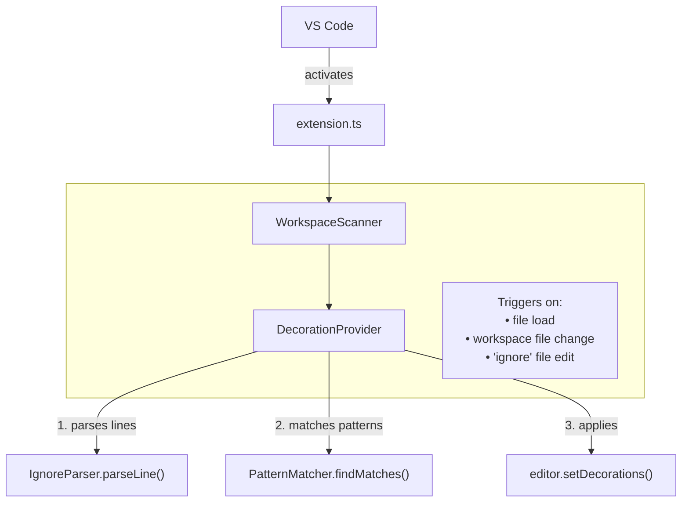

# IgnoreLens Flow

How the extension components connect.

## Components

- **extension.ts** - Entry point, registers event handlers
- **WorkspaceScanner** - Scans workspace for files
- **DecorationProvider** - Manages line decorations and match counts
- **IgnoreParser** - Parses ignore file lines (patterns, comments, blanks)
- **PatternMatcher** - Checks patterns against workspace files
