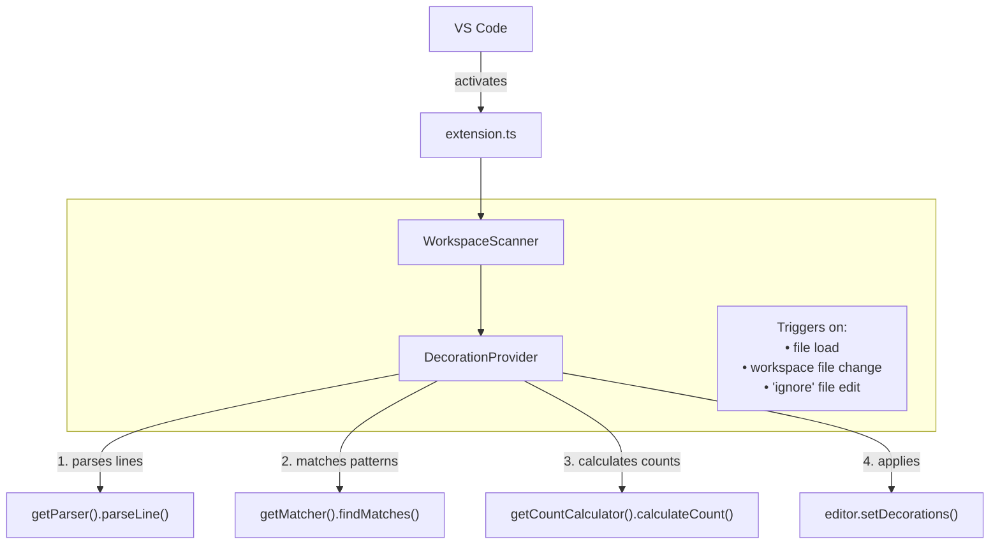

# IgnoreLens Flow

How the extension components connect.

```mermaid
flowchart TD
    A[VS Code] -->|activates| B[extension.ts]
    B --> C

    subgraph " "
        C[WorkspaceScanner] --> D[DecorationProvider]
        N["Triggers on:<br>• file load<br>• workspace file change<br>• 'ignore' file edit"]
    end


    D -->|1. parses lines| E["getParser().parseLine()"]
    D -->|2. matches patterns| F["getMatcher().findMatches()"]
    D -->|3. calculates counts| H["getCountCalculator().calculateCount()"]
    D -->|4. applies| G["editor.setDecorations()"]
```

## Components

- **extension.ts** - Entry point, registers event handlers
- **WorkspaceScanner** - Scans workspace for files
- **DecorationProvider** - Manages line decorations and match counts
- **parserStrategy.ts** - Strategy pattern for parsing (GitignoreParser, VscodeignoreParser)
- **matcherStrategy.ts** - Strategy pattern for matching (GitignoreMatcher, VscodeignoreMatcher)
- **countStrategy.ts** - Strategy pattern for count calculation (GitignoreCountCalculator, VscodeignoreCountCalculator)
