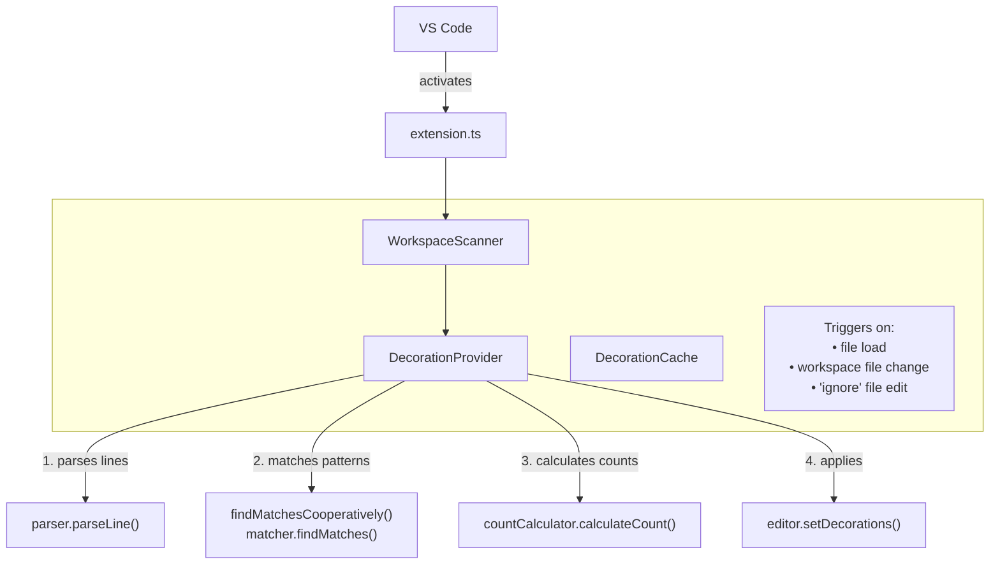

# IgnoreLens Flow

How the extension components connect.

```mermaid
flowchart TD
    A[VS Code] -->|activates| B[extension.ts]
    B --> C

    subgraph " "
        C[WorkspaceScanner] --> D[DecorationProvider]
        K[DecorationCache]
        N["Triggers on:<br>• file load<br>• workspace file change<br>• 'ignore' file edit"]
    end


    D -->|1. parses lines| E["parser.parseLine()"]
    D -->|2. matches patterns| F["findMatchesCooperatively()<br>matcher.findMatches()"]
    D -->|3. calculates counts| H["countCalculator.calculateCount()"]
    D -->|4. applies| G["editor.setDecorations()"]
```

## Components

- **extension.ts** - Entry point and event coordination
- **WorkspaceScanner** - Scans and caches workspace file paths
- **DecorationProvider** - Coordinates parsing, matching, counting, caching, and decorations
- **decorationCache.ts** - Caches decoration data for immediate display when switching tabs
- **supportedFiles.ts** - Maps supported filenames to their matching semantics
- **parserStrategy.ts** - Parses ignore lines according to the file format
- **matcherStrategy.ts** - Matches patterns against workspace file paths
- **countStrategy.ts** - Calculates each pattern's effect on the running ignored-file count
